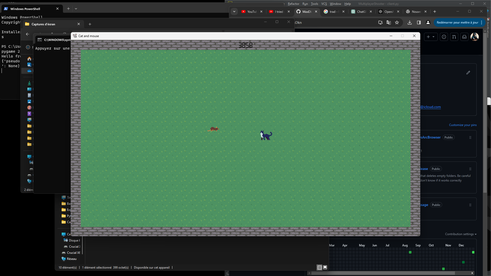

# Cat and Mouse Game in Python

Welcome to the Cat and Mouse game, a simple and fun game created in Python using the Pygame library.

## Game Rules

- **Objective:** Touch the opponent to score points.
- **Player 1 Controls:** Use the `ZQSD` keys to move.
- **Player 2 Controls:** Use the `OKLM` keys to move.
- **Role Reversal:** Every 10 seconds, the roles of cat and mouse reverse.

## Prerequisites

- Python 3.x
- Pygame (install it with `pip install pygame`)
- PyTMX (install it with `pip install pytmx`)
- PyScroll (install it with `pip install pyscroll`)

## Running the Game

1. Ensure you have Python installed on your machine.
2. Install the necessary dependencies by running the following commands in your terminal:
    ```bash
    pip install pygame
    pip install pytmx
    pip install pyscroll
    ```
3. Launch the game by executing the `launch.bat` script.

## Credits

- **Assets:** The assets used in this game were found on [itch.io](https://itch.io/).

## Notes

- This game was created for entertainment and learning purposes.
- Feel free to contribute by suggesting improvements or bug fixes.

Enjoy the game!
